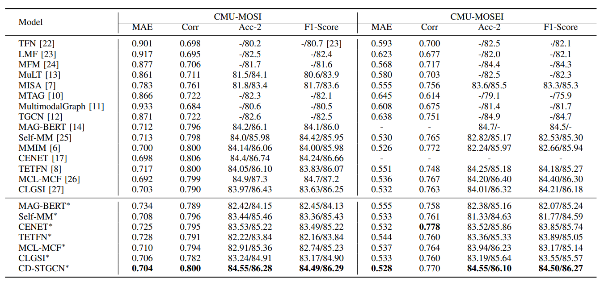

# Improving Multimodal Sentiment Analysis with a Consistency-Driven Spatio-Temporal Graph Convolutional Network


Traditional Multimodal Sentiment Analysis (MSA) methods typically acquire sentiment features from each modality through sequence modeling techniques (e.g., LSTM). In these methods, the extraction of sentiment features within each modality is based on the order of input sequence, which may result in missing important sentiment cues due to the sequential memory mechanism. In addition, existing methods directly combine sentiment cues from different modalities, overlooking the possibility that the derived sentiment features might display conflicting sentiment polarities, which, if integrated, would result in sentiment features confusing the SA classifier. To address these issues, we first improve the extraction of sentiment information within each modality using a Spatio-Temporal Graph Convolutional Network (STGCN). It can dynamically adjust the learnable sentiment propagation on the Spatio-Temporal Graph for each modality, facilitating the spread of sentiment information that enhances MSA results. Subsequently, we enhance the fusion of sentiment cues from various modalities using a novel cross-modal fusion mechanism driven by consistency, avoiding the fusion of conflicting sentiment cues from different modalities. Extensive experiments on four benchmark MSA datasets show that our method significantly outperforms state-of-the-art models on all datasets. The code will be available upon the publication of this paper.

## Requirements

To install requirements:

```setup
pip install -r requirements.txt
```

## Training

Train the model using different hyperparameters. Please write the Python script according to `tune_mosi.py`.

```python
from STGCN import STGCN_run

STGCN_run(model_name='stgcn', dataset_name='mosi',config_file='./STGCN/config/config_tune_nips.json',seeds=[1111],is_tune=True, tune_times=500,model_save_dir='./model/model_saved/saved_model',res_save_dir='./res', log_dir='./log',num_workers=0, gpu_ids=[0])
```

Train our model using fixed hyperparameters. Please write the Python script according to `normal_mosi.py`.

```python
from STGCN import STGCN_run

STGCN_run(model_name='stgcn', dataset_name='mosi',config_file='./STGCN/config/config_best.json',seeds=[1111],
         is_tune=False, model_save_dir='./model/model_saved/saved_model',res_save_dir='./res',
         log_dir='./log',num_workers=0, gpu_ids=[0])
```

The datasets supported in this work are 'mosi', 'mosei', 'sims', and 'simsv2'. If you want to train on the mosi or mosei datasets, choose the 'stgcn' model. If you want to train on the sims and simsv2 datasets, choose the 'mstgcn' model.

- `config_file`: The configuration file for dataset and model hyperparameters.
- `seeds`: Random seeds for model training.
- `is_tune`: True means using different hyperparameters for tuning, with the corresponding `config_file` being `config_tune.json`. False means using fixed hyperparameters for training, with the corresponding `config_file` being `config_best.json`, which contains the best hyperparameters obtained after tuning and can help you partially reproduce our results.
- `model_save_dir`: The directory to save the model.
- `res_save_dir`: The directory to save the results.
- `log_dir`: The directory to save the logs.
- `num_workers`: The number of worker processes.
- `gpu_ids`: The GPU IDs used for training.

Run the following command to train the model with fixed parameters: 

```train
python normal_mosi.py
```

Run the following command to train the model with different parameters: 

```train
python tune_mosi.py
```


## Evaluation

To evaluate our model, you can write the code according to the `test.py`.

```python
from STGCN import STGCN_test

STGCN_test(model_name='stgcn', dataset_name='mosi',config_file='./STGCN/config/config_best.json',seeds=[1111], is_tune=False, model_save_dir='./model/model_saved/saved_model',res_save_dir='./res', log_dir='./log',num_workers=0, gpu_ids=[0])
```

For the specific meanings of the parameters, please refer to the Training section.  Run the following command to evaluate the model.

```evaluation
python test.py
```

## Pre-trained Models

We use the pre-trained BERT model. For English datasets, we use `bert-base-uncased`, and for Chinese datasets, we use `bert-base-chinese`. Both models can be obtained from the official website. To run our model, these two pre-trained models are required. Please download them and place the `bert-base-uncased` and `bert-base-chinese` directories in the same directory as the training model's Python file.

## Checkpoint

To verify the authenticity of our reported results we have saved the files of the best-performing model on the CMU-MOSI dataset. You can test them by accessing the link: https://pan.baidu.com/s/1a82Pv_mmbH2MeRmIeMWAdQ?pwd=t37j (code: t37j) and navigating to the `model_trained` folder, where you will find two model files.

Please note, when reproducing the results using `test.py`, remember to rename the file to `stgcn-mosi.pth`.

- `stgcn-mosi_Non0_acc_2.pth` corresponds to the "negative/positive" binary classification metric.
- `stgcn-mosi_Has0_acc_2.pth` corresponds to the "negative/non-negative" binary classification metric.

## Results



For more results, please refer to our paper.


